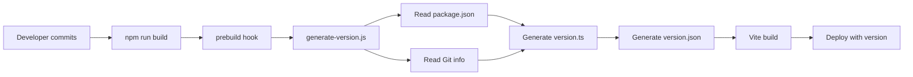

# Automatisk Versjonsnummerering - Implementeringsguide

## Oversikt

Løsningen består av følgende komponenter:

```
PlenPilot/
├── scripts/
│   └── generate-version.js          # Hovedscript for versjonsgenerering
├── src/
│   ├── version.ts                   # Auto-generert (gitignored)
│   ├── version.ts.template          # Template for første build
│   ├── components/ui/
│   │   └── VersionDisplay.tsx       # UI-komponent for å vise versjon
│   └── utils/
│       └── version-logger.ts        # Logger versjon til console
├── public/
│   └── version.json                 # Auto-generert (gitignored)
├── .github/
│   └── workflows/
│       └── build-and-deploy.yml     # CI/CD eksempel
└── docs/
    ├── VERSIONING.md                # Full dokumentasjon
    ├── VERSIONING-QUICKSTART.md     # Quick start guide
    └── VERSIONING-IMPLEMENTATION.md # Denne filen
```

## Versjonsnummereringslogikk

### Format: `MAJOR.MINOR.PATCH-BUILD_NUMBER+COMMIT_HASH`

Eksempel: `1.0.0-42+a3f5b2c`

- **MAJOR.MINOR.PATCH**: Fra package.json (manuell semantic versioning)
- **BUILD_NUMBER**: Git commit count (automatisk)
- **COMMIT_HASH**: Git short hash (automatisk)

### Workflow



## Teknisk implementering

### 1. Version Generation Script

**File:** `scripts/generate-version.js`

Funksjoner:
- Leser version fra `package.json` via `npm pkg get version`
- Henter Git commit count via `git rev-list --count HEAD`
- Henter Git commit hash via `git rev-parse --short HEAD`
- Henter Git branch via `git rev-parse --abbrev-ref HEAD`
- Detekterer uncommitted changes via `git status --porcelain`
- Genererer timestamp for build
- Skriver til `src/version.ts` (TypeScript)
- Skriver til `public/version.json` (Runtime)

### 2. Package.json Integration

**Key scripts:**

```json
{
  "scripts": {
    "prebuild": "node scripts/generate-version.js",
    "build": "tsc -b && vite build",
    "version:generate": "node scripts/generate-version.js",
    "version:show": "node -e \"console.log(require('./public/version.json'))\""
  }
}
```

**prebuild hook** kjører automatisk før `npm run build`.

### 3. Generated Files

**src/version.ts** (TypeScript constants):
```typescript
export const VERSION_INFO = {
  version: "1.0.0-42",
  fullVersion: "1.0.0-42+a3f5b2c",
  baseVersion: "1.0.0",
  buildNumber: 42,
  commitHash: "a3f5b2c",
  branch: "master",
  isDirty: false,
  buildDate: "2026-02-02T12:00:00.000Z",
  buildTimestamp: 1738497600000
} as const;
```

**public/version.json** (Runtime accessible):
```json
{
  "version": "1.0.0-42",
  "fullVersion": "1.0.0-42+a3f5b2c",
  "buildNumber": 42,
  "commitHash": "a3f5b2c",
  "branch": "master",
  "isDirty": false,
  "buildDate": "2026-02-02T12:00:00.000Z",
  "buildTimestamp": 1738497600000
}
```

### 4. Git Configuration

**Additions to .gitignore:**
```
# Auto-generated version files
src/version.ts
public/version.json
```

Dette unngår merge-konflikter da filer genereres dynamisk.

## Bruksmønstre

### A. Compile-time Access (TypeScript)

```typescript
import { VERSION, VERSION_INFO } from './version';

console.log(VERSION); // "1.0.0-42"
console.log(VERSION_INFO.commitHash); // "a3f5b2c"
```

### B. Runtime Access (Fetch API)

```typescript
const response = await fetch('/version.json');
const version = await response.json();
console.log(version.buildNumber);
```

### C. UI Component

```tsx
import { VersionDisplay } from './components/ui/VersionDisplay';

// Compact: "v1.0.0-42"
<VersionDisplay variant="compact" />

// Detailed: Full version info
<VersionDisplay variant="detailed" />
```

### D. Console Logging

```typescript
import './utils/version-logger';
// Auto-logs version info to console on import
```

## Deployment Scenarios

### Scenario 1: Local Development

```bash
# Developer workflow
git add .
git commit -m "Add feature"
npm run build  # Version auto-increments: 1.0.0-5 -> 1.0.0-6
```

**Characteristics:**
- `isDirty: true` if uncommitted changes exist
- Build number increases with each commit
- Instant feedback in console

### Scenario 2: GitHub Actions CI/CD

```yaml
- uses: actions/checkout@v4
  with:
    fetch-depth: 0  # CRITICAL: Full Git history required

- run: npm ci
- run: npm run build  # prebuild auto-generates version
```

**Characteristics:**
- `isDirty: false` (clean checkout)
- Consistent build numbers across environments
- Can create Git tags automatically

### Scenario 3: Manual Deploy

```bash
# Ensure clean state
git status

# Build
npm run build

# Deploy dist/ folder
# Version info is embedded in build
```

## Version Update Strategies

### Minor/Patch Updates (Automated)

Build number increments automatically with each commit.

No action required.

### Major/Minor Version Bumps (Manual)

```bash
# Update semantic version
npm version patch  # 1.0.0 -> 1.0.1
npm version minor  # 1.0.0 -> 1.1.0
npm version major  # 1.0.0 -> 2.0.0

# This creates a Git commit and tag automatically
# Build number continues from Git commit count
```

## Advantages of This Approach

### 1. Zero Merge Conflicts
- Version files gitignored
- Generated at build-time
- Git is source of truth

### 2. Consistent Across Environments
- Same script for local and CI/CD
- Deterministic based on Git state
- No environment-specific logic

### 3. Full Traceability
- Commit hash links to exact code
- Build number shows progression
- Timestamp shows when built

### 4. Developer-Friendly
- Automatic via prebuild hook
- No manual steps required
- Fallback for non-Git environments

### 5. CI/CD Ready
- Works with GitHub Actions, GitLab CI, etc.
- No secrets or credentials needed
- Just requires Git history

## Common Issues and Solutions

### Issue: "Git command not found"

**Cause:** Git not in PATH or not installed

**Solution:** Script automatically falls back to dev version:
```json
{
  "version": "0.0.0-dev",
  "commitHash": "unknown"
}
```

### Issue: Build number not increasing

**Cause:** Uncommitted changes

**Solution:**
```bash
git add .
git commit -m "Your changes"
npm run build
```

### Issue: Wrong build number in CI

**Cause:** Shallow clone (`fetch-depth: 1`)

**Solution:** Use `fetch-depth: 0` in checkout action:
```yaml
- uses: actions/checkout@v4
  with:
    fetch-depth: 0
```

### Issue: Version file missing

**Cause:** First build hasn't run yet

**Solution:**
```bash
npm run version:generate
```

Or copy template:
```bash
cp src/version.ts.template src/version.ts
```

## Testing

### Test Script Generation

```bash
npm run version:generate
cat public/version.json
```

### Test Build Integration

```bash
npm run build
# Should show version generation output
```

### Test UI Component

```bash
npm run dev
# Open app, check console for version info
# Add <VersionDisplay /> to any component
```

### Test CI/CD (Local)

```bash
# Simulate clean checkout
rm -rf node_modules dist
rm src/version.ts public/version.json

# Simulate CI build
npm ci
npm run build

# Verify version was generated
cat public/version.json
```

## Performance

- **Script execution:** ~50-100ms
- **Impact on build:** Negligible (<1% of total build time)
- **Runtime overhead:** Zero (constants)
- **File size:** <1KB (both files combined)

## Security Considerations

- No sensitive data exposed (commit hash is public)
- No credentials required
- Git history is already public in most projects
- Can be excluded from production builds if needed

## Future Enhancements

Potential additions:
- Release notes generator from commit messages
- Automatic Git tagging on successful deploy
- Version comparison API endpoint
- Integration with error tracking (Sentry, etc.)
- Changelog generator
- Version-based feature flags

## Maintenance

### Regular Maintenance
- No maintenance required
- Script is stateless
- No database or external dependencies

### Updates
- Script can be versioned in Git
- Changes are backward compatible
- Old builds remain valid

## Rollback Strategy

If you need to rollback:

1. **Code rollback:**
   ```bash
   git checkout <previous-commit>
   npm run build
   # Version will match rolled-back commit
   ```

2. **Version mismatch:**
   Version is tied to Git commit, so rolling back code automatically gives correct version.

3. **Emergency:**
   Version files can be manually edited if needed (though not recommended).

## Summary

This versioning system provides:
- Automatic version management
- Zero configuration for daily use
- Full traceability and audit trail
- Works locally and in CI/CD
- No merge conflicts
- Developer-friendly experience

Implementation is complete and production-ready.
